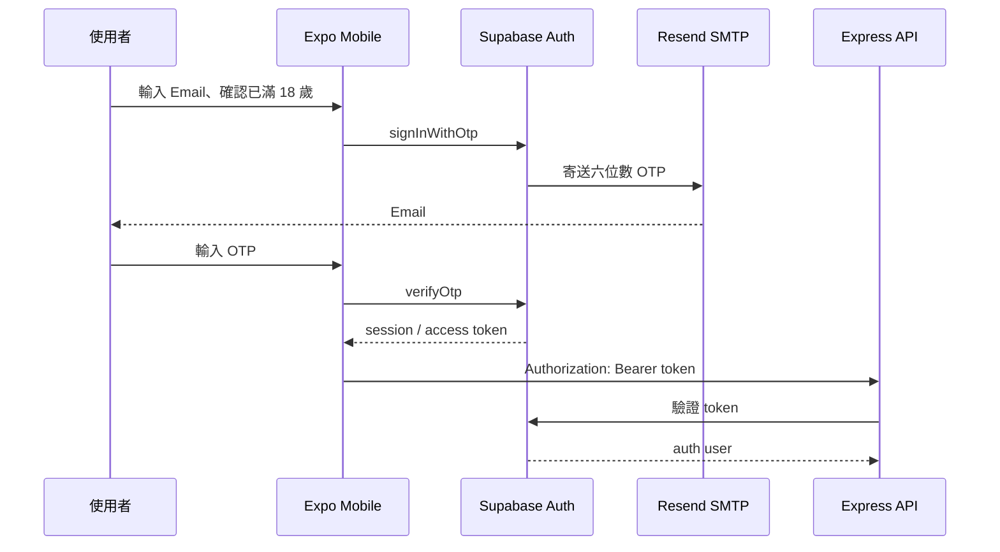
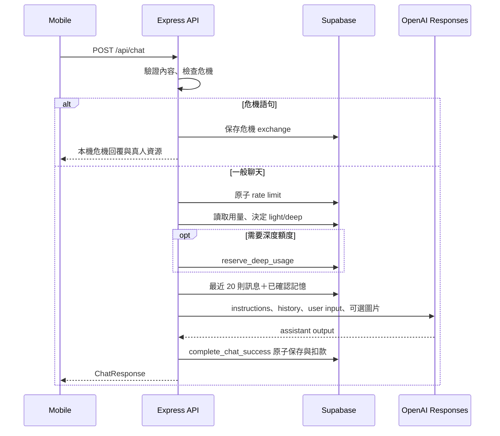
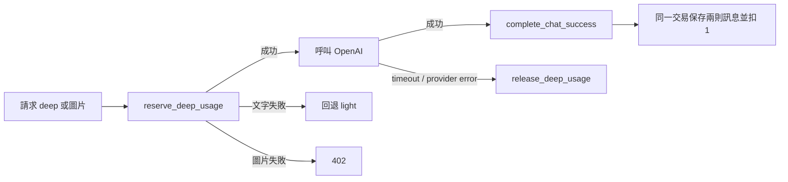
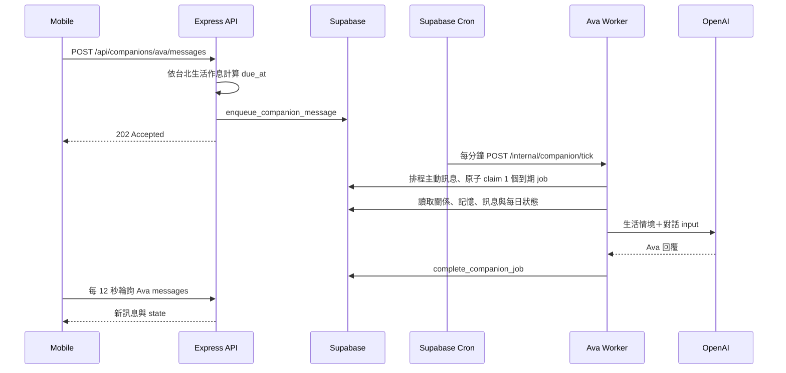

# SoftPlace 系統架構

## 架構概覽

SoftPlace 是 npm workspaces monorepo。Mobile 只持有公開 Supabase 設定與 API URL；所有 OpenAI、service-role、Worker 與資料寫入權限都留在 server。

| 元件 | 責任 |
| --- | --- |
| `apps/mobile` | Expo React Native UI、Passwordless Auth session、呼叫 API、畫面輪詢 |
| `apps/server` | Auth 驗證、業務規則、OpenAI、額度、危機攔截、Ava Worker |
| `packages/shared` | Mobile／Server 共用 request、response 與 domain 型別 |
| Supabase Auth | Email OTP、access token、使用者身分 |
| Supabase Postgres | 對話、記憶、額度、Ava 狀態與 job；RLS／RPC |
| Supabase Vault／Cron | 保存 Worker secret、每分鐘觸發 Ava tick |
| OpenAI | Responses API 生成安放與 Ava 回覆 |
| Resend SMTP | 由 Supabase Auth 寄送 OTP Email |
| Zeabur | 從 GitHub `main` 自動 build／deploy Express API |

## Passwordless Auth

App 使用同步 request lock、disabled 狀態與 60 秒重寄倒數降低重複寄送。新登入使用者第一次呼叫 API 時由 server 建立 `profiles`，方案預設為 `free`。

## 安放即時聊天

文字深度額度不足時回退輕量；圖片固定使用深度模型，Free 不開放，深度額度不足時拒絕。OpenAI 或完成交易失敗會釋放 reservation，不保存半套對話，也不扣正式用量。

## 深度額度 reservation

`deep_usage_reservations` 避免並行請求超用；TTL 預設 120 秒。一般聊天限制預設每分鐘 12 則、每小時 120 則。危機模式在限流之前處理。

## Ava 非同步 Worker

Ava 生活以 `Asia/Taipei` 計算，同一日期對所有使用者選到相同生活日。完整分時表留在 server；OpenAI 只收到「訊息傳來時」與「目前」的簡短情境。Worker 每次最多 claim 1 個 job，lease 與 RPC 避免同一 job 被重複完成。

Server 已有 Expo push sender、push token API 與資料表，但 Mobile 尚未安裝並註冊 Android push token，因此目前由 Ava 頁面每 12 秒、App 其他分頁每 30 秒輪詢。

## API

除 `/health` 與 Worker endpoint 外，所有 `/api` route 都需要 Supabase Bearer token。

| Method | Route | 用途 |
| --- | --- | --- |
| `GET` | `/health` | 服務健康檢查 |
| `POST` | `/api/chat` | 安放文字／圖片聊天 |
| `GET` | `/api/conversations/current/messages` | 單一時間線分頁 |
| `DELETE` | `/api/conversations/current` | 清除目前時間線 |
| `GET` | `/api/conversations` | 對話摘要相容介面 |
| `GET/POST` | `/api/memories` | 安放記憶列表／新增 |
| `PATCH/DELETE` | `/api/memories/:id` | 安放記憶修改／刪除 |
| `GET` | `/api/me/usage` | 方案與深度用量 |
| `GET` | `/api/companions/ava` | Ava 狀態 |
| `GET/POST` | `/api/companions/ava/messages` | Ava 時間線／送訊息 |
| `PATCH` | `/api/companions/ava/preferences` | 主動等級與安靜時間 |
| `POST` | `/api/companions/ava/read` | 標記已讀 |
| `GET/PATCH/DELETE` | `/api/companions/ava/memories...` | Ava 記憶管理 |
| `DELETE` | `/api/companions/ava/relationship` | 清除 Ava 關係資料 |
| `POST/DELETE` | `/api/push-tokens` | Push token 註冊／停用 |
| `POST` | `/internal/companion/tick` | Vault secret 保護的 Worker |

## 資料表與所有權

安放核心：`profiles`、`conversations`、`messages`、`memories`、`usage_limits`。

成本保護：`chat_rate_limit_windows`、`deep_usage_reservations`。

Ava：`companion_definitions`、`companion_daily_states`、`user_companions`、`companion_messages`、`companion_memories`、`companion_jobs`、`companion_daily_usage`、`push_tokens`。

一般使用者可透過 RLS 讀取自己的核心資料；實際 App 寫入主要由 server 使用 service-role 完成。成本保護與 Ava 資料表不開放 anon／authenticated 直接存取，只允許 service-role 與受控 RPC。

## 模型與上下文

| 路徑 | 預設模型 | 上下文 |
| --- | --- | --- |
| 安放 light | `gpt-4o-mini` | 最近 20 則＋確認記憶＋light prompt |
| 安放 deep | `gpt-5.4-mini` | 最近 20 則＋確認記憶＋deep prompt |
| 安放圖片 | deep model | 同上，加單張壓縮圖片 |
| Ava | `gpt-5.4-mini` | Worker 取得的近期訊息、關係、低敏感記憶與生活情境 |

模型名稱均由 server env 控制。`AI_PROVIDER=local` 只供明確的本機開發回覆，不會在 OpenAI 設定缺失時靜默回退。

## 隱私設計

- Mobile 不持有 `OPENAI_API_KEY`、service-role、Worker secret 或 SMTP password。
- 安放與 Ava 對話由 Supabase 保存，不使用 OpenAI Conversations 作為資料來源。
- Responses API 預設 `store:false`，並使用 hashed `safety_identifier`。
- 圖片壓縮後隨 request 傳送，不永久保存原圖；資料庫只保存 `image_present`。
- Runtime error logs 不應包含聊天全文、圖片 base64、push token 或 credential。
- `OPENAI_DEBUG_IO` 會輸出文字 input/output，只能以虛構內容短暫除錯，完成後立即關閉。
